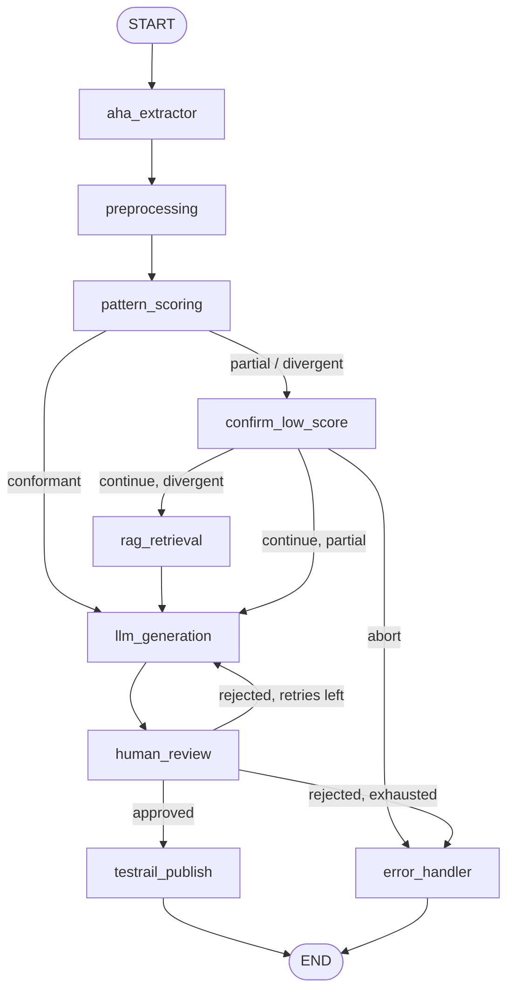

# Nodes & State

Reference for the LangGraph pipeline: every node, what it reads and writes,
and the shared `PipelineState` that flows between them. Source of truth is
`app/state.py` (state schema) and the one-file-per-node modules in
`app/nodes/` (graph wiring lives in `app/graph/build_graph.py`).

## Graph at a glance



Every node (except `error_handler`) is wrapped in `@safe_node` (`app/nodes/utils.py`):
exceptions are caught and converted into `state["error"]`, which the
conditional edges route to `error_handler` instead of crashing the run.

## PipelineState

Defined in `app/state.py`. Nodes return a **partial** dict of updates;
LangGraph merges them into the running state. All fields are optional
(`total=False`).

| Field | Set by | Meaning |
|---|---|---|
| `aha_feature_id` | input (`app/main.py`) | Aha! feature identifier (e.g. `AHA-205`). Doubles as the LangGraph `thread_id`. |
| `feature_raw` | `aha_extractor` | Raw Aha! payload: `id`, `name`, `description`, `acceptance_criteria`, `comments`, `attachments`. |
| `feature_markdown` | `preprocessing` | Structured Markdown of the feature (description, criteria, comments, attachments). |
| `feature_metadata` | `preprocessing` | Completeness signals: `has_description`, `acceptance_criteria_count`, `comment_count`, `attachment_count`. |
| `pattern_conformance` | `pattern_scoring` | `"conformant"` / `"partial"` / `"divergent"` — how well the ticket follows company patterns. |
| `pattern_score_rationale` | `pattern_scoring` | One/two-sentence explanation of the score. |
| `score_review_decision` | `confirm_low_score` | `"continue"` or `"abort"` — the human's answer at the score gate. |
| `retrieved_context` | `rag_retrieval` | RAG chunks (company standards, prior test cases) used to ground generation. |
| `generated_test_cases` | `llm_generation` | `list[TestCase]` (`title`, `preconditions`, `steps`, `expected_result`, `priority`, `tags`). |
| `review_decision` | `human_review` | `"approved"` / `"rejected"` (initial value `"pending"`). |
| `review_feedback` | `human_review` | Optional text fed back into regeneration on rejection. |
| `testrail_run_id` | `testrail_publish` | TestRail run created for the published cases. |
| `testrail_results` | `testrail_publish` | Per-test-case `{"title", "status": "created"\|"error", "testrail_case_id", "error"}`. |
| `published` | `testrail_publish` / `error_handler` | `True` once cases are published. |
| `error` | `confirm_low_score` (abort), any node via `safe_node` | Failure reason; routes to `error_handler`. `None` on success. |
| `retry_count` | `llm_generation` | Generation attempts; capped at `MAX_RETRIES` (3) by `route_after_review`. |

## Nodes

### `aha_extractor`
`app/nodes/aha_extractor.py` — **reads** `aha_feature_id`, **writes** `feature_raw`.

Calls the `get_aha_feature` LangChain tool (currently mock-backed in
`app/mocks/aha_features.py`; swap for real HTTP in `app/tools/aha_tools.py`).

### `preprocessing`
`app/nodes/preprocessing.py` — **reads** `feature_raw`, **writes** `feature_markdown`, `feature_metadata`.

Normalizes the raw payload into structured Markdown plus lightweight
completeness metadata used by `pattern_scoring` (and available to the LLM).

### `pattern_scoring`
`app/nodes/pattern_scoring.py` — **reads** `feature_markdown`, **writes** `pattern_conformance`, `pattern_score_rationale`.

Scores the ticket against the rubric in `company_patterns.md` using an LLM
(`gpt-4o-mini`, structured output). Requires `OPENAI_API_KEY`; without it the
run stops here with an error.

**Routing** (`route_after_scoring`): `conformant` → `llm_generation`;
`partial` / `divergent` → `confirm_low_score`.

### `confirm_low_score`
`app/nodes/confirm_low_score.py` — **reads** `pattern_conformance`, **writes** `score_review_decision` (and `error` on abort).

Human-in-the-loop gate reached when the ticket is not fully `conformant`.
Pauses via `interrupt()` and asks the operator whether to proceed anyway.

**Routing** (`route_after_score_confirmation` → `decide_rag_usage`):
`abort` → `error_handler`; `continue` + `divergent` → `rag_retrieval`;
`continue` + `partial` → `llm_generation` (RAG skipped for speed/cost).

### `rag_retrieval`
`app/nodes/rag_retrieval.py` — **reads** `feature_markdown` (+ `feature_metadata`), **writes** `retrieved_context`.

Retrieves the top-k chunks from an in-memory vector store seeded with
`COMPANY_KNOWLEDGE_SEED` (`app/knowledge_base.py`). Only runs for
`divergent` tickets.

### `llm_generation`
`app/nodes/llm_generation.py` — **reads** `feature_markdown`, `retrieved_context`, `review_feedback`, **writes** `generated_test_cases`, `retry_count`.

Generates structured, TestRail-ready `TestCase`s with `gpt-4o-mini`. On
rejection, `review_feedback` is injected into the prompt for the next attempt.

### `human_review`
`app/nodes/human_review.py` — **reads** `generated_test_cases`, **writes** `review_decision`, `review_feedback`.

Pauses via `interrupt()` and surfaces the generated cases for QA approval.

**Routing** (`route_after_review`): `approved` → `testrail_publish`;
`rejected` + retries left → `llm_generation` (loop back); `rejected` +
`MAX_RETRIES` exhausted → `error_handler`.

### `testrail_publish`
`app/nodes/testrail_publish.py` — **reads** `aha_feature_id`, `generated_test_cases`, **writes** `testrail_run_id`, `testrail_results`, `published`.

Publishes approved cases via the `publish_test_cases_to_testrail` tool
(currently mock-backed in `app/mocks/testrail_runs.py`).

### `error_handler`
`app/nodes/error_handler.py` — **reads** `error`, **writes** `published` (`False`).

Terminal node reached on any routed failure or an aborted score gate. Logs
the failure (TODO: notify QA/engineering) and marks the run as not published.

## Routing helpers

- `route_on_error(next_node, source_node)` — `app/nodes/utils.py`: go to
  `next_node` on success, `error_handler` when `state["error"]` is set.
- `route_after_scoring` / `route_after_score_confirmation` / `route_after_review`
  — the decision routers above. Each logs a debug-level `EDGE: source -> (label) -> target`
  line (visible with debug logging / LangSmith).

## Console progress visualization

`app/graph/progress.py` (`GraphProgressLogger`, wired in `app/main.py` via
`config={"callbacks": [...]}`) renders a step-by-step line per event so you
can see where the run is in the graph:

```
→ START
→ aha_extractor          ✓ aha_extractor
→ pattern_scoring        ✓ pattern_scoring  score=divergent
→ confirm_low_score      ⏸ confirm_low_score  waiting for human decision…
▸ confirm_low_score      resumed…
✓ confirm_low_score      decision=continue
→ testrail_publish       ✓ PUBLISHED  run=R-1005
```

See `README.md` for run instructions and the LangGraph Studio / LangSmith UIs.
