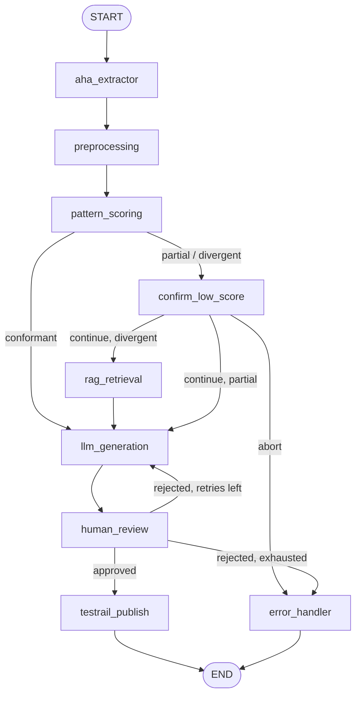

# AI-Powered Test Case Generation from Aha! Features Using RAG

A [LangGraph](https://langchain-ai.github.io/langgraph/) pipeline that extracts Aha! features, retrieves relevant organizational knowledge (RAG), generates TestRail test cases with an LLM, routes them through human QA review, and publishes approved cases to TestRail.

See [`project.md`](./project.md) for the full problem statement and architecture.
See [`NODES_AND_STATE.md`](./NODES_AND_STATE.md) for every node and the `PipelineState` fields.

## Graph



## Tools

| Tool | Description | Status |
|---|---|---|
| [`get_aha_feature`](./app/tools/aha_tools.py) | Fetch Aha! feature (description, acceptance criteria, comments, attachments) | Mock data |
| [`publish_test_cases_to_testrail`](./app/tools/testrail_tools.py) | Publish approved test cases as a TestRail run | Mock data |

## Structure

```
app/
  state.py                # PipelineState / TestCase types
  main.py                 # CLI entrypoint (interrupt/resume loop)
  console.py              # rich rendering/prompting
  llm_config.py           # llm_configured() - real vs stub LLM
  company_patterns.py     # Loads company_patterns.md (scoring + RAG source)
  knowledge_base.py       # Seeds company standards into RAG vector store
  tools/                  # @tool functions above (mock-backed)
  mocks/                  # Mock Aha! features + TestRail responses
  graph/build_graph.py    # StateGraph wiring + MemorySaver checkpointer
  nodes/                  # One file per graph node (see diagram)
company_patterns.md       # Source of truth for ticket-creation standards
requirements.txt
```

## Scoring & routing

[`company_patterns.md`](./company_patterns.md) defines what a well-formed feature ticket looks like. `pattern_scoring` judges each feature as `conformant` / `partial` / `divergent`:

- **LLM scorer** (the only scorer) — requires `OPENAI_API_KEY`; without it, the run stops at `pattern_scoring` with an error.
- `conformant` → straight to `llm_generation`.
- `partial` / `divergent` → pause at `confirm_low_score` (human continues/aborts); on continue, `divergent` also runs RAG, `partial` skips it.

The same standards are seeded into the RAG vector store (`knowledge_base.py`) so generation is grounded in the same rubric. Edit `company_patterns.md` to change what "conformant" means.

## RAG — how it works (partially mocked, partially real)

RAG only runs for `divergent` tickets (`rag_retrieval` node), to ground test case generation in company standards:

1. An in-memory vector store is seeded with `COMPANY_KNOWLEDGE_SEED` (`app/knowledge_base.py`) — 5 static docs split out of `company_patterns.md` (naming, coverage, structure, prioritization, ticket completeness).
2. The feature Markdown is embedded with **real** OpenAI embeddings (`text-embedding-3-small`) and the top-4 chunks are retrieved by similarity.
3. `llm_generation` injects those chunks into its prompt, so `gpt-4o-mini` grounds the test cases in the same rubric the scorer used.

**What's real:** the embedding calls, the similarity search, and grounding the LLM output on retrieved context.
**What's mocked/limited:** the knowledge corpus is a small hardcoded seed (one file, rebuilt in memory on every run) rather than a real ingested corpus with persistence — no pgvector/Pinecone/Chroma, no ingestion pipeline yet. Swap `InMemoryVectorStore` + `COMPANY_KNOWLEDGE_SEED` for a persistent store once real knowledge sources exist (see `project.md`).
**Without `OPENAI_API_KEY`:** `rag_retrieval` logs a warning and returns empty context — generation then runs without RAG grounding.

## Mock fixtures

10 generic features (`AHA-101`–`AHA-110`) plus fixtures purpose-built to hit each tier:

| Feature | Score | Behavior |
|---|---|---|
| `AHA-201` | `divergent` | Gate triggers, RAG runs on continue |
| `AHA-202`/`203`/`204` | `partial` | Gate triggers, RAG skipped |
| `AHA-205`/`206` | `conformant` | No gate |

```powershell
python -m app.main --feature-id AHA-201   # divergent - answer "n" to abort
python -m app.main --feature-id AHA-202   # partial - answer "y" to continue
python -m app.main --feature-id AHA-205   # conformant - no gate
```

Any other ID falls back to `DEFAULT_AHA_FEATURE_MOCK` (empty, scores `divergent`). Swap the `get_mock_*` calls in `app/tools/` for real HTTP calls once API clients are implemented.

## LangGraph features

- **`StateGraph`** + **`MemorySaver`** checkpointing (swap for SQLite/Postgres for persistence).
- **Human-in-the-loop**: `confirm_low_score` and `human_review` via `interrupt()`, resumed with `{"continue": ...}` / `{"decision": ..., "feedback": ...}`.
- **Retry loop**: `human_review` loops back on rejection, capped at `MAX_RETRIES` (3) — **up to 3 total generation attempts**. Each `llm_generation` run increments `retry_count` (1 → 2 → 3). Rejecting after the 3rd attempt trips `retry_count >= MAX_RETRIES` and routes to `error_handler` (`NOT PUBLISHED`). Approving any of the 3 exits the loop early → `testrail_publish`.
- **Error handling**: `safe_node` wraps every node, routing failures to `error_handler` without crashing the graph.
- **Edge logging**: every conditional edge logs `EDGE: source -> (label) -> target` for tracing.

## How to run

```bash
python3 -m venv .venv
source .venv/bin/activate
pip install -r requirements.txt
```

Set `OPENAI_API_KEY` in a `.env` file — required, since without it the run stops at `pattern_scoring`.

```bash
python -m app.main --feature-id AHA-205
```

`--feature-id` doubles as the LangGraph `thread_id` (re-running resumes that thread). Best mock features:

| Feature | Tier | Behavior |
|---|---|---|
| `AHA-205` | `conformant` | No gate |
| `AHA-202` | `partial` | Pauses, answer `y`/`n` |
| `AHA-201` | `divergent` | Pauses, RAG runs on continue |

At the prompts: `y`/`n` for the score gate; approve/reject at review. Rejecting loops back to generation — up to 3 attempts total (`MAX_RETRIES`), after which the run ends `NOT PUBLISHED`.

## UIs: LangGraph Studio & LangSmith

### LangGraph Studio — interactive graph UI

The graph is registered as `test_case_pipeline` in [`langgraph.json`](./langgraph.json). To open the interactive UI (visualize nodes/edges, start runs per thread, step through interrupts):

```bash
pip install "langgraph-cli"     # if not already installed
langgraph dev
```

- Uses [`langgraph.json`](./langgraph.json) (assistant `test_case_pipeline`, `"env": ".env"` so your keys are loaded).
- Open **http://127.0.0.1:2024** in your browser.
- Pick a thread (e.g. `AHA-205`), start a run, and step through the graph. When it pauses on an interrupt, resume with `{"continue": true}` or `{"decision": "approved"}` (same payloads the CLI sends).
- `langgraph up` starts the same UI via Docker instead of a local build — handy when you don't want a Python env; it builds from [`langgraph.json`](./langgraph.json).

### LangSmith — trace / observability UI

Every run (nodes, LLM calls, RAG retrieval, edges, interrupts, retries) is visualized as a **trace** at [smith.langchain.com](https://smith.langchain.com). Opt-in via env vars (already stubbed in [`.env.example`](./.env.example)):

```bash
LANGSMITH_TRACING=true
LANGSMITH_API_KEY=lsv2_...
LANGSMITH_PROJECT=capstone-test-case-gen
```

Put these in your `.env` — loaded automatically by the app (CLI runs) and by `"env": ".env"` in `langgraph.json` (Studio runs) — then run the pipeline as usual:

```bash
python -m app.main --feature-id AHA-201
```

Each run shows up as a trace under `capstone-test-case-gen` on smith.langchain.com: inspect per-node input/output, token usage, and the interrupt/resume payloads. No code changes needed — LangChain/LangGraph auto-instrument when `LANGSMITH_TRACING=true` is set.
