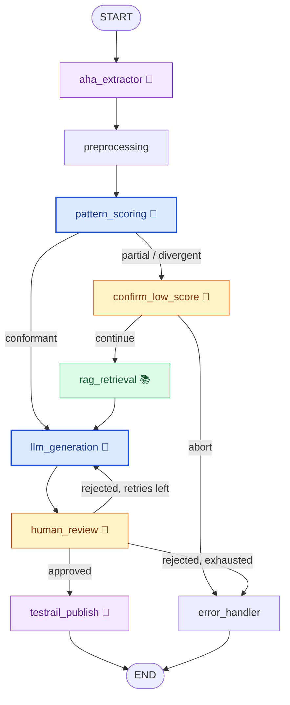

# AI-Powered Test Case Generation from Aha! Features Using RAG

> **InfoQ Certified AI Engineering capstone** — cohort: `july-2026-ai-americas-cohort` · team: **Luiz Bonfioli** (individual project)

A [LangGraph](https://langchain-ai.github.io/langgraph/) pipeline that extracts Aha! features, retrieves relevant organizational knowledge (RAG), generates TestRail test cases with an LLM, routes them through human QA review, and publishes approved cases to TestRail.

See [`project.md`](./project.md) for the full problem statement and architecture.
See [`NODES_AND_STATE.md`](./NODES_AND_STATE.md) for every node and the `PipelineState` fields.

## Graph

The graph's nodes fall into four categories:

- 🧠 **Chat LLM** — `pattern_scoring`, `llm_generation` each call `gpt-4o-mini` (scoring + test-case generation).
- 📚 **Embeddings** — `rag_retrieval` calls the `text-embedding-3-small` embeddings API.
- 🧑 **Human-in-the-loop** — `confirm_low_score` (continue/abort) and `human_review` (approve/reject) pause via `interrupt()`.
- 🔧 **LangChain tools (mock-backed)** — `aha_extractor` (`get_aha_feature`) and `testrail_publish` (`publish_test_cases_to_testrail`).

The remaining nodes (`preprocessing`, `error_handler`) are deterministic, pure-Python — no LLM, embeddings, tool, or human interaction.



**Legend**

| Marker | Color | Nodes | Role |
|---|---|---|---|
| 🧠 | Blue | `pattern_scoring`, `llm_generation` | Calls the chat LLM (`gpt-4o-mini`) |
| 📚 | Green | `rag_retrieval` | Calls the embeddings API (`text-embedding-3-small`) |
| 🧑 | Amber | `confirm_low_score`, `human_review` | Pauses for human input via `interrupt()` |
| 🔧 | Purple | `aha_extractor`, `testrail_publish` | Calls a LangChain tool (`get_aha_feature` / `publish_test_cases_to_testrail`), mock-backed |
| — | Plain | `preprocessing`, `error_handler` | Deterministic, pure Python (no LLM / embeddings / tool / human) |


## Rubric-based evaluation (LLM-as-judge) + human evaluation (HITL)

A **rubric** is a set of written criteria for grading. The LLM reads the rubric + the artifact and returns a **typed verdict** (score + rationale) — that's **LLM-as-judge**. A human can then override that verdict — that's **human evaluation (HITL)**.

**LLM-as-judge** — `pattern_scoring` grades the feature ticket against [`company_patterns.md`](./company_patterns.md) → `conformant` / `partial` / `divergent`. The verdict drives routing: `conformant` generates directly; any weak ticket (`partial` / `divergent`) goes through the human gate + RAG.

**Human evaluation (HITL)** — two nodes pause via `interrupt()`:

- **`confirm_low_score`** — a human vets the LLM's score (`continue` / `abort`) before generating from a weak ticket.
- **`human_review`** — a human approves or rejects the generated test cases; a rejection regenerates (max 3 attempts), an approval publishes.

**In short:** the **LLM judges the input**; **humans judge the verdict and the output**.

## Evals

There is a deliberately small eval suite in [`eval/`](./eval/) — a **golden data set** plus one measurement, sized for the demo. See [`docs/EVALS.md`](./docs/EVALS.md) for the full picture (data set, checks, gates, current measured baseline, limitations). In short:

- **`python -m eval.run_evals`** runs the real graph headlessly over the golden set (6 mock Aha! fixtures annotated with an expected tier), auto-resumes every human-gate interrupt, and scores each run on two things: **golden-tier accuracy** (does the LLM-as-judge verdict match the expected tier) and **structural quality** (are the generated test cases well-formed). A per-case table prints to the console.
- It **exits non-zero on failure**, so it can gate a deploy in CI. The chat model comes from `OPENAI_CHAT_MODEL` (default `gpt-4o-mini`).
- What's measured: golden-tier accuracy (currently 0.67 — the judge is stricter than design intent on a couple of thin fixtures, see `docs/EVALS.md` §5) and structural quality (currently 1.00).

This sits on top of the in-loop evaluation:

- **LLM-as-judge** — `pattern_scoring` grades each feature ticket against the rubric in [`company_patterns.md`](./company_patterns.md) → `conformant` / `partial` / `divergent`, and the verdict routes the graph. This judges the **input**; the eval suite judges the **output**.
- **Human evaluation (HITL)** — `confirm_low_score` vets the LLM's score; `human_review` approves/rejects generated cases (a rejection feeds feedback into a regen, max 3 attempts).

Current measured baseline (all gates PASS): every generated batch scores a perfect **1.0 structural quality**, and **golden-tier accuracy is 0.67** — with the caveat that the full-rubric LLM judge grades a couple of thin fixtures stricter than design intent (see `docs/EVALS.md` §5).

## RAG — how it works (partially mocked, partially real)

RAG runs for every weak ticket (`partial` or `divergent` — `rag_retrieval` node) to ground test case generation in company knowledge about the ticket's problem, filling in detail the weak ticket is missing:

1. An in-memory vector store is seeded with `COMPANY_KNOWLEDGE_SEED` (`app/knowledge_base.py`) — the test-case/ticket standards split out of `company_patterns.md` (naming, coverage, structure, prioritization, ticket completeness) plus problem-domain company knowledge (performance, auth/SSO, uploads, exports, notifications, RBAC, search, billing, rate limiting, audit logging, theming, password security).
2. The feature Markdown is embedded with **real** OpenAI embeddings (`text-embedding-3-small`) and the top-6 chunks are retrieved by similarity, each tagged with a `source_label` ("Company standard" vs "Company knowledge").
3. `llm_generation` injects those chunks into its prompt, so `gpt-4o-mini` grounds the test cases in the company standards **and** the problem-domain knowledge that addresses what the weak ticket leaves out.

- **What's real** — the embedding calls, the similarity search, and grounding the LLM output on retrieved context.
- **What's mocked/limited** — the knowledge corpus is a small hardcoded seed (one file, rebuilt in memory on every run) rather than a real ingested corpus with persistence — no pgvector/Pinecone/Chroma, no ingestion pipeline yet. Swap `InMemoryVectorStore` + `COMPANY_KNOWLEDGE_SEED` for a persistent store once real knowledge sources exist (see `project.md`).
- **Without `OPENAI_API_KEY`** — `rag_retrieval` logs a warning and returns empty context; generation then runs without RAG grounding.

## Structure

```
app/
  state.py                # PipelineState / TestCase types
  main.py                 # CLI entrypoint (interrupt/resume loop)
  console.py              # rich rendering/prompting
  llm_config.py           # llm_configured() - real vs stub LLM
  company_patterns.py     # Loads company_patterns.md (scoring + RAG source)
  knowledge_base.py       # Seeds company standards into RAG vector store
  tools/                  # @tool functions above (mock-backed)
  mocks/                  # Mock Aha! features + TestRail responses
  graph/build_graph.py    # StateGraph wiring + MemorySaver checkpointer
  nodes/                  # One file per graph node (see diagram)
company_patterns.md       # Source of truth for ticket-creation standards
requirements.txt
```

## Mock fixtures

10 generic features (`AHA-101`–`AHA-110`) plus fixtures purpose-built to hit each tier:

| Feature | Score | Behavior |
|---|---|---|
| `AHA-201` | `divergent` | Gate triggers, RAG runs on continue |
| `AHA-202`/`203`/`204` | `partial` | Gate triggers, RAG runs on continue |
| `AHA-205`/`206` | `conformant` | No gate |

```powershell
python -m app.main --feature-id AHA-201   # divergent - answer "n" to abort
python -m app.main --feature-id AHA-202   # partial - answer "y" to continue
python -m app.main --feature-id AHA-205   # conformant - no gate
```

Any other ID falls back to `DEFAULT_AHA_FEATURE_MOCK` (empty, scores `divergent`). Swap the `get_mock_*` calls in `app/tools/` for real HTTP calls once API clients are implemented.

## Commands

### Setup

```bash
python3 -m venv .venv
source .venv/bin/activate
pip install -r requirements.txt
```

Set `OPENAI_API_KEY` in a `.env` file — required.

### Run the pipeline

```bash
python -m app.main --feature-id AHA-205
```

`--feature-id` doubles as the LangGraph `thread_id` (re-running resumes that thread). Best mock features: `AHA-205` (conformant, no gate), `AHA-202` (partial, pauses + RAG on continue), `AHA-201` (divergent, pauses + RAG on continue). At the prompts: `y`/`n` for the score gate; approve/reject at review (rejecting loops back — up to 3 attempts total, then `NOT PUBLISHED`).

### LangGraph Studio — interactive graph UI

```bash
pip install "langgraph-cli"
langgraph dev
```

Opens **http://127.0.0.1:2024** — visualize nodes/edges, run per thread, resume interrupts with `{"continue": true}` / `{"decision": "approved"}`. `langgraph up` runs the same UI via Docker.

### LangSmith — trace / observability UI

```bash
LANGSMITH_TRACING=true
LANGSMITH_API_KEY=lsv2_...
LANGSMITH_PROJECT=capstone-test-case-gen
```

Put these in your `.env`, then run the pipeline as usual — every run shows up as a trace at smith.langchain.com.

## Lessons learned

Working through the **july-2026-ai-americas-cohort** taught me as much about *how to build agents* as about the pipeline itself:

1. **From Copilot CLI + skills to authoring agents.** I started by using skills to write code for me; building this agent flipped me into designing the system itself — state, nodes, edges, routing — instead of having an assistant write my files.

2. **Observability and traceability.** The human gates and `error_handler` make every run inspectable, and LangSmith lets me answer "what did the system see, decide, and produce?" for any run. For an LLM system, that traceability is the trust story.

3. **Evals for accuracy.** Evals are the load-bearing wall, not the final chapter. The LLM-as-judge disagreed with my expected tiers on three golden fixtures; that mismatch drove real decisions (keep the 0.50 gate, fix `AHA-202`) instead of being hidden.

4. **RAG techniques.** Retrieval grounds generation in company knowledge — but only when needed: RAG runs for weak (`partial`/`divergent`) tickets and skips `conformant` ones. The techniques that mattered were *when* to retrieve (routing weak tickets through RAG), *what* to retrieve (top-k over a corpus of rubric standards + problem-domain knowledge), and injecting the chunks into the prompt so the LLM generates against the same standards the scorer used.

5. **Agent frameworks.** LangGraph's `StateGraph`, `MemorySaver`, and `interrupt()` / `Command(resume=...)` made state routing and human-in-the-loop pause/resume straightforward — a framework that models state and control flow beats a script with callbacks.

6. **Production, governance and security guardrails.** Structured output, RAG + human review against hallucination, retry caps, and env-driven config are edges of the graph, not bolt-ons.
