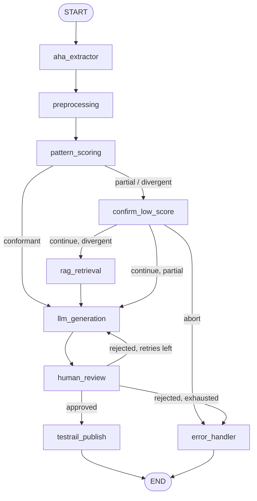

# How This Project Works

A plain-language walkthrough of the InfoQ capstone: what the pipeline does,
and — most importantly — what **state**, **node**, and **edge** mean in *this*
codebase.

> This file explains the concepts. For the exhaustive reference of every node
> and state field, see [`NODES_AND_STATE.md`](./NODES_AND_STATE.md). For run
> instructions and the UIs (LangGraph Studio / LangSmith), see
> [`README.md`](./README.md).

---

## 1. What the project does

This is an **AI-powered test case generator** that turns an Aha! feature ticket
into ready-to-publish TestRail test cases:

1. It fetches a feature from **Aha!** (currently mocked).
2. It normalizes the raw payload into clean **Markdown**.
3. An LLM **scores** how complete/conformant the ticket is against company
   standards (`company_patterns.md`).
4. If the ticket deviates from those standards, it optionally retrieves
   relevant company knowledge via **RAG** to ground the generation.
5. An LLM **generates** structured test cases (title, steps, expected result,
   priority, tags).
6. A **human QA reviewer** approves or rejects them (with a retry loop on
   rejection).
7. Approved cases are **published to TestRail** (currently mocked).

Every step of that list is implemented as a *node* in a *graph*, and the data
passed between steps is the *state*.

---

## 2. The mental model: a graph, not a script

The pipeline is **not** a linear `if/else` script. It is a **directed graph**
defined in [`app/graph/build_graph.py`](./app/graph/build_graph.py) using
LangGraph's `StateGraph`:

- **Nodes** are the units of work (the `aha_extractor`, the LLM call, the human
  gate, ...).
- **Edges** decide which node runs next, based on the data in the state.

A run starts at `START`, hops from node to node along edges, and ends at `END`.
Because edges can *read* the state, the same graph produces very different
executions depending on the input feature and on human decisions:



The three building blocks — **state**, **node**, and **edge** — are the whole
story. Everything below is just detail about how this project uses them.

---

## 3. The three building blocks

### 3.1 State — the shared memory

**What it is.** State is one single dictionary that represents *everything the
pipeline knows at any moment*. It is defined as a `TypedDict` called
[`PipelineState`](./app/state.py#L42) in `app/state.py`.

Think of it as a **whiteboard being carried through a factory floor**: each
worker (node) reads the notes they need, writes their own notes, and hands the
board to the next station. Nobody keeps a private copy — there is exactly one
board.

**The key mechanic.** A node never returns the whole state. It returns a
**partial dict of updates**, and LangGraph merges those updates into the running
state. For example, `aha_extractor` only returns
`{"feature_raw": {...}}` — the rest of the state is untouched.

All fields are optional (`total=False`). Here are the important ones:

| Field | Meaning | Set by |
|---|---|---|
| `aha_feature_id` | The feature we're working on (`AHA-205`) | Input (CLI) |
| `feature_raw` | The raw Aha! payload | `aha_extractor` |
| `feature_markdown` | The feature as clean Markdown | `preprocessing` |
| `feature_metadata` | Completeness signals (has description? # criteria? ...) | `preprocessing` |
| `pattern_conformance` | `"conformant"` / `"partial"` / `"divergent"` — how well the ticket follows company patterns | `pattern_scoring` |
| `pattern_score_rationale` | The scorer's explanation | `pattern_scoring` |
| `score_review_decision` | `"continue"` / `"abort"` — human's answer at the score gate | `confirm_low_score` |
| `retrieved_context` | RAG chunks grounding the generation | `rag_retrieval` |
| `generated_test_cases` | The generated `TestCase`s | `llm_generation` |
| `review_decision` | `"approved"` / `"rejected"` | `human_review` |
| `review_feedback` | QA's comments fed back into regeneration | `human_review` |
| `testrail_run_id` / `testrail_results` / `published` | Publish outcome | `testrail_publish` |
| `error` | Failure reason; routes the run to `error_handler` | any failed node |
| `retry_count` | How many generation attempts so far (capped at 3) | `llm_generation` |

**Why it matters for the design:** because edges read the state, a node's
*write* later becomes another node's *routing input*. `pattern_scoring` writes
`pattern_conformance`; a conditional edge reads it to decide whether a human
gate is needed; `rag_retrieval`'s decision to run also reads it.

State is also **checkpointed** by a `MemorySaver` checkpointer
([`build_graph.py`](./app/graph/build_graph.py#L133)). That snapshot is what
lets the graph pause at an `interrupt()` and resume later — the checkpoint
remembers exactly where it was.

### 3.2 Nodes — the workers

**What it is.** A node is a single Python function that takes the current state,
does one unit of work, and returns the partial updates described above. Nodes
are registered on the graph in `build_graph.py` (`graph.add_node(...)`).

The general shape every node follows:

```python
@safe_node("node_name")                       # catches errors -> state["error"]
def node_name(state: PipelineState) -> dict:
    needed = state["some_field"]              # READ what it needs
    result = do_work(needed)                  # DO the work
    return {"another_field": result}          # WRITE partial updates
```

**The two flavors of node in this project:**

1. **Transform nodes** — do work and move on. `preprocessing` turns `feature_raw`
   into Markdown; `pattern_scoring` asks an LLM for a score; `llm_generation`
   asks an LLM for test cases; `testrail_publish` calls the TestRail tool.

2. **Gate / pause nodes** — stop the graph and wait for a human. Both
   `confirm_low_score` and `human_review` call LangGraph's `interrupt()`, which
   *halts execution right there* and returns control to the caller. The run only
   continues when someone resumes it with `Command(resume=...)`.

Here are all nine nodes, with what each reads and writes:

| Node | Reads from state | Writes to state | Kind |
|---|---|---|---|
| `aha_extractor` | `aha_feature_id` | `feature_raw` | transform (calls Aha! tool) |
| `preprocessing` | `feature_raw` | `feature_markdown`, `feature_metadata` | transform |
| `pattern_scoring` | `feature_markdown` | `pattern_conformance`, `pattern_score_rationale` | transform (LLM) |
| `confirm_low_score` | `pattern_conformance`, `pattern_score_rationale` | `score_review_decision`, `error` | gate (interrupt) |
| `rag_retrieval` | `feature_markdown` | `retrieved_context` | transform (RAG) |
| `llm_generation` | `feature_markdown`, `retrieved_context`, `review_feedback` | `generated_test_cases`, `retry_count` | transform (LLM) |
| `human_review` | `generated_test_cases` | `review_decision`, `review_feedback` | gate (interrupt) |
| `testrail_publish` | `aha_feature_id`, `generated_test_cases` | `testrail_run_id`, `testrail_results`, `published` | transform (TestRail tool) |
| `error_handler` | `error` | `published` (`False`) | terminal |

Every node except `error_handler` is wrapped in `@safe_node`
([`app/nodes/utils.py`](./app/nodes/utils.py#L18)), which catches exceptions and
converts them into `state["error"]` — so a failure becomes a *routing signal*
rather than a crash.

### 3.3 Edges — the routing

**What it is.** An edge is the connection between two nodes — it answers the
question *"after this node finishes, which node runs next?"* There are two kinds
in `build_graph.py`:

**Static edge (`add_edge`)** — always goes to the same next node. Used for
unconditional hops:

```python
graph.add_edge(START, "aha_extractor")          # always start with extraction
graph.add_edge("error_handler", END)            # always finish after errors
```

**Conditional edge (`add_conditional_edges`)** — a *router function* inspects the
state and returns the name of the next node. This is where the decision-making
lives:

```python
graph.add_conditional_edges(
    "pattern_scoring",
    route_after_scoring,          # reads state["pattern_conformance"]
    {
        "llm_generation": "llm_generation",       # conformant -> generate
        "confirm_low_score": "confirm_low_score", # partial/divergent -> ask human
        "error_handler": "error_handler",
    },
)
```

`route_after_scoring` is a plain function that returns a node name from the
state:

```python
def route_after_scoring(state):
    if state.get("error"):
        return "error_handler"
    if state.get("pattern_conformance") == "conformant":
        return "llm_generation"
    return "confirm_low_score"
```

Every router logs a trace line — `EDGE: pattern_scoring -> (conformant) ->
llm_generation` — so you can follow exactly which edge was taken.

**The four decision points in this project** are all conditional edges:

1. `route_on_error(...)` (after `aha_extractor`, `preprocessing`, `rag_retrieval`,
   `llm_generation`, `testrail_publish`) — continue to the next node, or divert
   to `error_handler` if `state["error"]` is set.
2. `route_after_scoring` — `conformant` skips straight to generation;
   `partial`/`divergent` hits the human score gate.
3. `route_after_score_confirmation` (+ `decide_rag_usage`) — after the human
   gate: `abort` → `error_handler`; `continue` + `divergent` → RAG then
   generation; `continue` + `partial` → generation without RAG.
4. `route_after_review` — `approved` → publish; `rejected` + retries left → loop
   back to generation; `rejected` + retries exhausted → `error_handler`.

---

## 4. A walkthrough: following one feature through the graph

### Case A — `AHA-205` (a "conformant" ticket, no gate, no RAG)

| Step | Node | State before | What happens | State after |
|---|---|---|---|---|
| 1 | **START** | `{aha_feature_id: "AHA-205"}` | static edge to `aha_extractor` | — |
| 2 | **aha_extractor** | input only | calls `get_aha_feature` tool (mock) | + `feature_raw` |
| 3 | **preprocessing** | + `feature_raw` | renders raw payload to Markdown, counts criteria/comments | + `feature_markdown`, `feature_metadata` |
| 4 | **pattern_scoring** | + `feature_markdown` | LLM scores the ticket against `company_patterns.md` | + `pattern_conformance: "conformant"`, `pattern_score_rationale` |
| 5 | *edge* | `conformant` | `route_after_scoring` → **llm_generation** (no gate, no RAG) | — |
| 6 | **llm_generation** | + `retrieved_context: []`, no feedback | LLM produces structured `TestCase`s; bumps `retry_count` → 1 | + `generated_test_cases`, `retry_count` |
| 7 | **human_review** | + `generated_test_cases` | `interrupt()` — CLI shows the cases and asks approve/reject | `Command(resume={"decision": "approved"})` → + `review_decision`, `review_feedback` |
| 8 | *edge* | `approved` | `route_after_review` → **testrail_publish** | — |
| 9 | **testrail_publish** | + approved cases | calls `publish_test_cases_to_testrail` tool (mock) | + `testrail_run_id`, `testrail_results`, `published: True` |
| 10 | **END** | done | run finishes | — |

### Case B — `AHA-201` (a "divergent" ticket: gate, then RAG)

Same as above until step 4, where the score comes back `"divergent"`:

| Step | Node | What happens |
|---|---|---|
| 5' | *edge* | `route_after_scoring` → **confirm_low_score** (score gate) |
| 6' | **confirm_low_score** | `interrupt()` — "Ticket scored 'divergent', continue anyway?" |
| 7' | *resume* | CLI answers `{"continue": true}` → `score_review_decision: "continue"` |
| 8' | *edge* | `decide_rag_usage` sees `divergent` → **rag_retrieval** (a `partial` ticket would skip straight to generation) |
| 9' | **rag_retrieval** | embeds `feature_markdown`, retrieves top-4 chunks from the company-knowledge vector store → + `retrieved_context` |
| 10' | **llm_generation** | same as Case A, but now the prompt is *grounded* in the retrieved company standards |
| 11' | ... | continues exactly like Case A from step 7 |

If at step 7' the human answers `{"continue": false}`, `confirm_low_score`
writes `error`, and the edge routes to **error_handler** → `published: False` →
**END**.

### Case C — a rejected review (the retry loop)

If the reviewer rejects at `human_review` with `{"decision": "rejected",
"feedback": "add negative cases"}`:

- `route_after_review` checks `retry_count` (1) against `MAX_RETRIES` (3) →
  still room → edge loops **back to `llm_generation`**, which now injects the
  `review_feedback` into its prompt and bumps `retry_count` to 2.
- This can happen at most 3 times total. Rejecting the 3rd attempt trips
  `retry_count >= MAX_RETRIES` → **error_handler** → `published: False`.

---

## 5. The mechanics that make the graph work

A few LangGraph features this project leans on — each one is just state + a
special kind of node or edge:

- **Human-in-the-loop.** `confirm_low_score` and `human_review` are nodes that
  call `interrupt()`. The CLI loop in
  [`app/main.py`](./app/main.py#L87) detects the pause (`"__interrupt__"` in the
  result), prompts the operator, and resumes with `Command(resume=...)`. The
  `MemorySaver` checkpointer is what makes pausing/resuming possible.

- **Error handling as routing.** `@safe_node` catches exceptions and sets
  `state["error"]`. The `route_on_error(...)` edges then turn that into a
  directed hop to `error_handler`. Failure is *data*, not a crash.

- **Optional RAG via routing.** RAG isn't a separate pipeline — it's just a node
  that some edges include and others skip, decided by
  `pattern_conformance` and the human's choice at the gate.

---

## 6. One-sentence summary

A LangGraph run is: a single `PipelineState` dictionary **flowing** through
**nodes** (the workers that read-and-update it), along **edges** (static or
state-reading conditional routes) that decide — including pausing for humans —
which worker runs next, until a terminal node (`END` or `error_handler`) is
reached.

See [`NODES_AND_STATE.md`](./NODES_AND_STATE.md) for the full field/node
reference and [`README.md`](./README.md) to run it.
