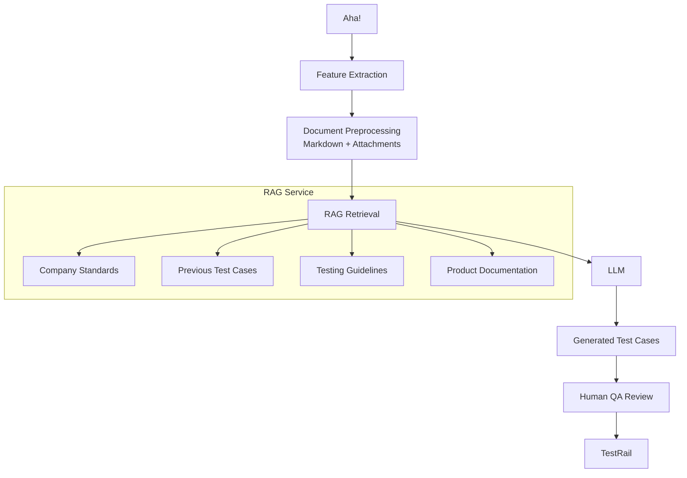

# Capstone Project Deliverable

## Project

**AI-Powered Test Case Generation from Aha! Features Using RAG**

### Problem Statement

QA engineers spend significant time manually creating test cases from Aha! feature requests. The process is repetitive, inconsistent, and dependent on individual experience — leading to missed edge cases and delayed feature validation.

### Solution

An AI-powered assistant that analyzes feature requirements, retrieves relevant organizational knowledge via Retrieval-Augmented Generation (RAG), and generates high-quality TestRail test cases for human review.

### Objectives

- Reduce manual test design effort by at least **30%**
- Improve consistency and completeness of test cases
- Increase coverage of edge and negative scenarios
- Standardize testing practices across engineering teams

### Success Metrics

| Metric | Target |
|---|---|
| Test case creation effort | −30% |
| Test coverage | Increased edge-case coverage |
| Review effort | Reduced rework |
| User adoption | Positive feedback from QA teams |

## Architecture

## Components

- **Aha! Extractor** – retrieves feature descriptions, acceptance criteria, comments, and attachments.
- **Preprocessing** – converts documents into structured Markdown and extracts metadata.
- **RAG Service** – retrieves relevant organizational knowledge from a vector database.
- **LLM** – generates structured test cases from retrieved context.
- **Human Review** – QA engineers validate and adjust generated results.
- **TestRail Integration** – publishes approved test cases.

## Data Flow

1. Feature is created in Aha!.
2. AI extracts and preprocesses the content.
3. Relevant documents are retrieved from the RAG.
4. The LLM generates proposed test cases.
5. QA reviews the output.
6. Approved test cases are published to TestRail.

## Risks & Mitigations

| Risk | Mitigation |
|---|---|
| Hallucinated test cases | Human review + RAG grounding |
| Outdated documentation | Regular knowledge ingestion |
| Missing context | Metadata filtering and retrieval optimization |
| Poor retrieval | Hybrid search and reranking |

---

## Article Outline

**Applying RAG to Accelerate Software Test Design**

1. Introduction
2. The Challenge of Manual Test Design
3. Why Traditional AI Is Not Enough
4. Using RAG to Ground Test Generation
5. Proposed Architecture
6. Knowledge Sources
7. Human-in-the-Loop Validation
8. Expected Business Benefits
9. Challenges and Future Improvements
10. Conclusion
